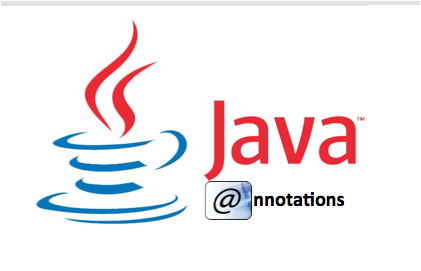

关于Java注解我们需要了解一下事实。

1. Java 注解（annotation) 为Java代码提供额外的信息。它不影响java代码本身的执行（区别于Python的装饰器，且其也是使用了@符号，看起来非常相似）。

2. Java有内置注解，同时也允许用户编写自定义注解。

3. Java注解的信息可以通过Java的反射API来获取。

Java1.5开始引入注解，自此注解被广泛使用到JavaEE框架中, 比如Hibernate, Spring等。

Java注解是代码的元数据（关于代码本身的信息）。注解被解释工具或者编译器来解析（反射），同时可以指定注解适用的时间，包括编译，运行时。

我们在spring web框架中配置的路由注解就是一个例子，在运行时，注解解析器根据Url路径规则匹配对应的方法。

下面是一个自定义注解的例子，看起来和定义一个接口（interfae)一样，只是多了一个@符号。
```
package com.journaldev.annotations;

import java.lang.annotation.Documented;
import java.lang.annotation.ElementType;
import java.lang.annotation.Inherited;
import java.lang.annotation.Retention;
import java.lang.annotation.RetentionPolicy;
import java.lang.annotation.Target;

@Documented
@Target(ElementType.METHOD)
@Inherited
@Retention(RetentionPolicy.RUNTIME)
public @interface MethodInfo{
	String author() default "Pankaj";
	String date();
	int revision() default 1;
	String comments();
}
```


