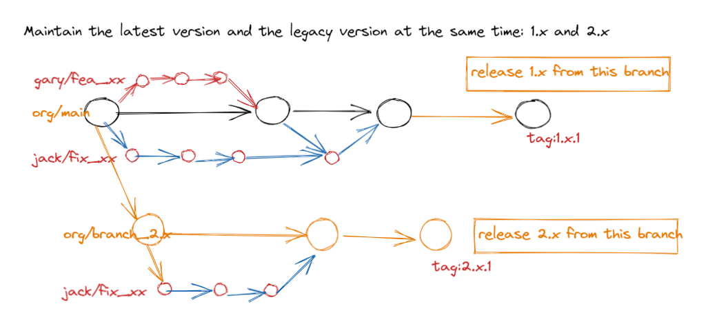

# Publish strategy

Before talking about the work flow for the repo branch management, we have to make it clear what publish strategies we use. This strategy we usually call version strategy. The branch management workflow serve this purpose.

Different products may apply different strategies. For example, if you are developing a software system that is install on customers' devices. We assume their device work by their own and don't need to update frequently except for terrible bug. Because hardware usually cannot upgrade to suit the high level version.(If they want to use the high software, they will need to buy new device, this is not acceptable for them).In this case, the software company maybe develop new version while maintain their old versions.

Another example is that, we develop for a website. As is know, website nowadays always changes a lot. For this kind of product, we don't need to keep a concept of version. We just deploy our new contents continually.

# Git workflow

Github is global open-source coding tracking platform. Developers from different places can collaborate and contribute their code together. Hence one aspect of developing project management is about the codes in the github repo.

Two problems we need to consider:

1. Relationship between new codes and pr.
2. How to manage released product.

When a team begins to track their code on github, the first most important issue is that how to manage the branch. We have to decide the life cycle of different branches for different issues: hot-fixes or features.

Software products or libraries release a lot these days, this means they rarely need to keep multiple versions. They publish the latest version and fix its issues at the same time and iterate on and on.

In this post, we will see two scenarios where we impose different git branch management strategies. The common place is that there is just one main branch for long term life cycle.

## Only maintain the latest version

When at the case that we develop very rapidly, we only need to maintain one latest version for the product.

In this workflow, we keep one main branch, which is long-term existing branch. Contributors fork this repo, pull the latest code, commit their codes, and impose a *pull request* to the team's main branch. After merged into the main branch, other contributors need to pull this update to their developing branch before impose their pull requests.

The below diagram simply shows what we do:

## Maintain multiple versions at the same time

When at the case that we want to develop a experimental feature, we may choose to for a develop branch for this feature. Usually we will make great changes in this experimental feature in this branch, and will track this branch for a major version upgrade, for example: 2.x. In this scenario, we can fork a new branch a the develop branch for this major version.

This scenario is almost like the above except that we keep two develop branch, "main branch" and "branch_2.x", in which case "branch_2.x" will exist for a relatively long duration before merged into main branch. When “branch_2.x" merged into main, we then go back to the flow in the previous section again.

The below diagram simply shows what we do:

## Reference

[Git 工作流程-阮一峰博客](http://www.ruanyifeng.com/blog/2015/12/git-workflow.html)