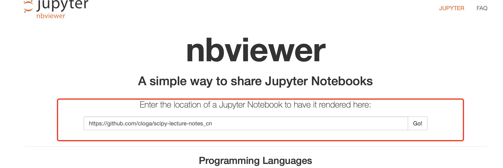

#### 资源

1. jupyter/nbviewer

	- **jupyter** 是一个基于网页（web-based)的markdown写作，脚本运行性的集成环境。你可以一遍写论文，一边用代码验证你的想法。默认是支持python, 其他语言(如Julia, R...)需要安装插件。
	
	使用jupyter之前，你需要安装python3 和pip, 然后使用pip 安装jupyter.
	或者您可以选择安装anoconda，它默认就已经包含了jupyter.
	
	*启动方法*： `jupyter notebook `
	
	- [nbviewer](https://nbviewer.jupyter.org)
	
	
	只需要把.ipynb 文件地址（目录也可以）复制进上图表单，它就可以帮助你渲染notebook 文件.
	
2. [几个爱好者对世界名校计算机课程翻译的库](https://github.com/Kivy-CN)

	主要是数据科学，编程等。

3. [欧林学院一位教授的个人博客](https://www.allendowney.com/blog/)

	他出版了好几本免费的计算机科学的书籍，这个网站是作者个人博客。

#### 文章

1. 